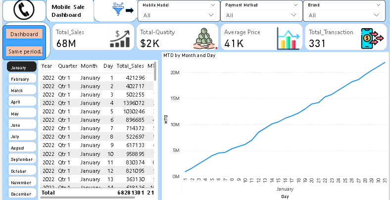
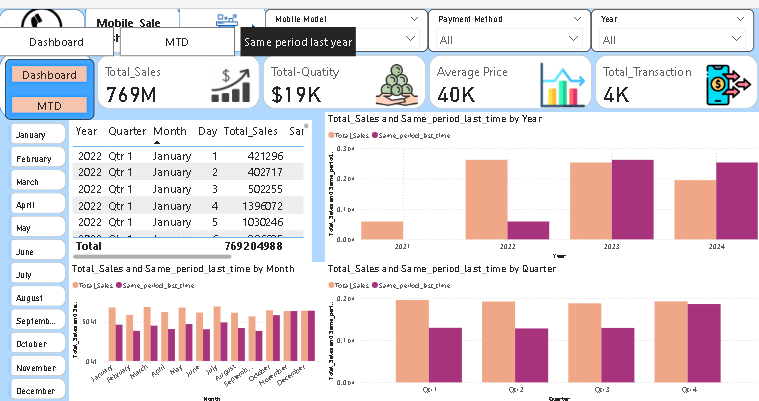

# Mobile-Sales-Dashboard

## Overview
This Power BI dashboard provides insights into mobile sales performance across regions, brands, and time periods.

## Data Source
- File containing mobile sales transactions
- Tables: `sales`, `products`, `regions`

## Transformations
- Cleaned data using Power Query (removed duplicates, standardized product names)
- Aggregated monthly sales and revenue
- Created relationships between sales, products, and regions

## Key Measures (DAX)
- **Total Sales** = SUM(sales[Quantity])
- **Total Revenue** = SUM(sales[Revenue])
- **Top Brand Sales** = RANKX(ALL(products[Brand]), SUM(sales[Quantity]))

## Dashboard Features
-  Trend analysis of monthly revenue
- Regional sales comparison
-  Top 5 brands by sales
-  Interactive slicers for region, brand, and time

## Insights
- Region X contributed the highest revenue
- Brand Y consistently ranked top in sales
- Seasonal spikes observed during festive months

## Screenshots

##Dashboard

# Month-to-Date (MTD)

# Same Period Last Year (SPLY)

